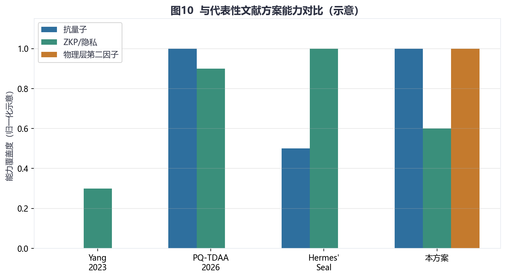
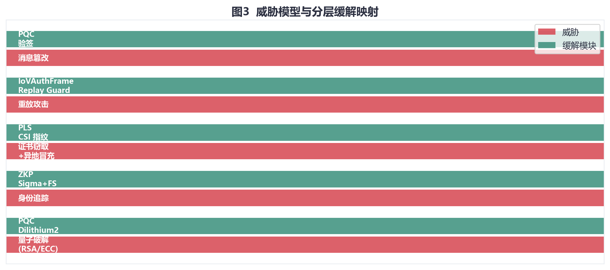
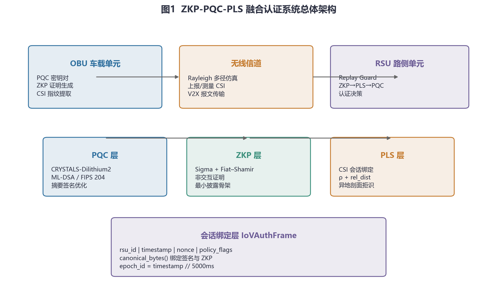
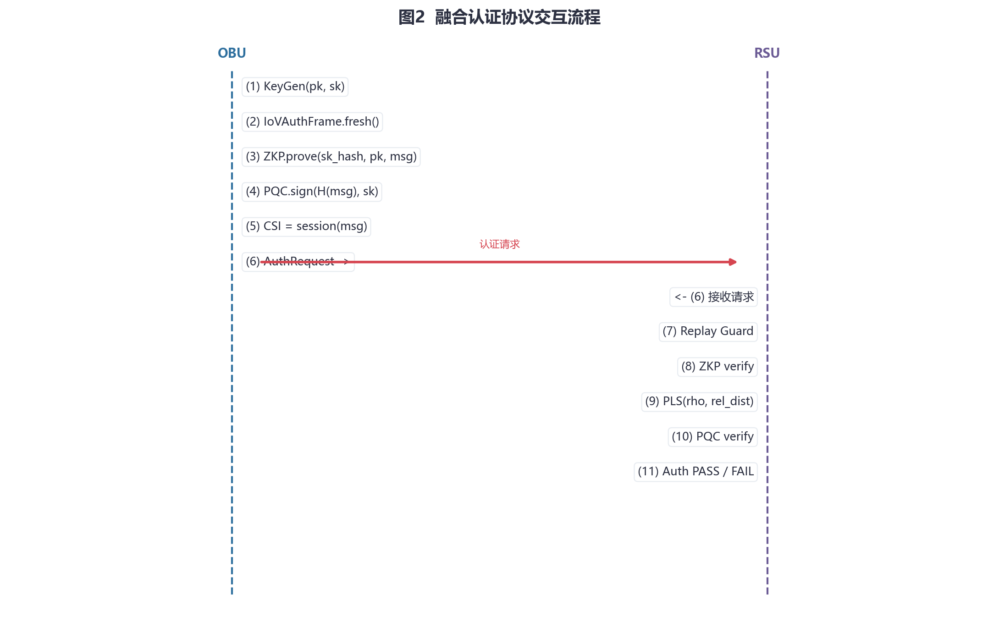
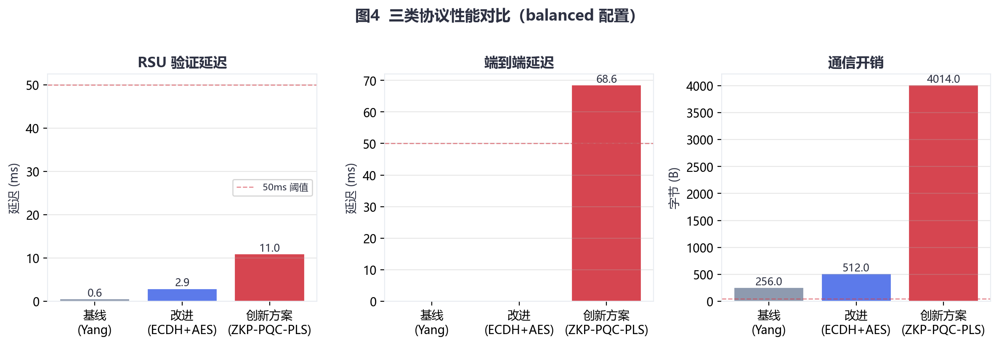
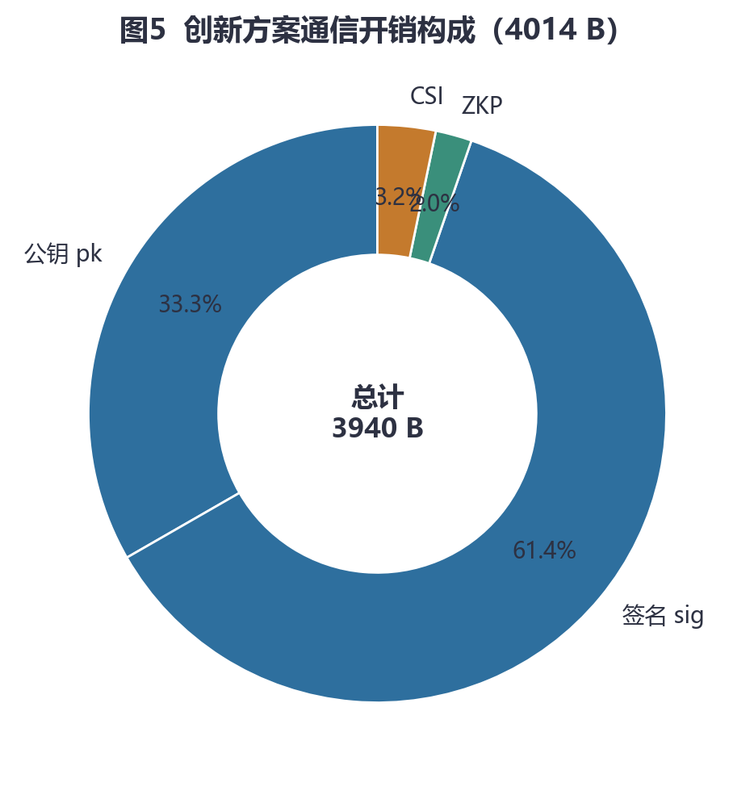
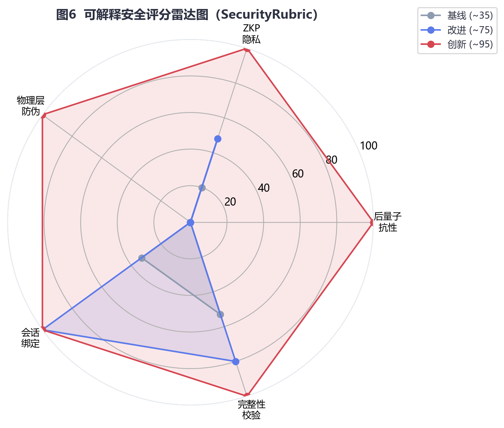
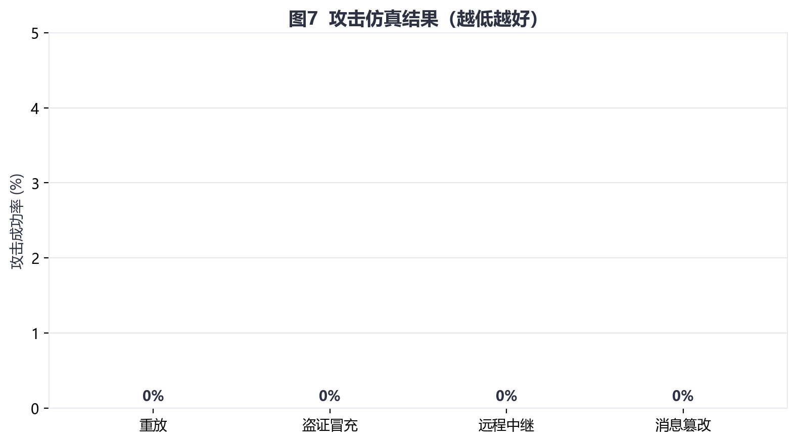
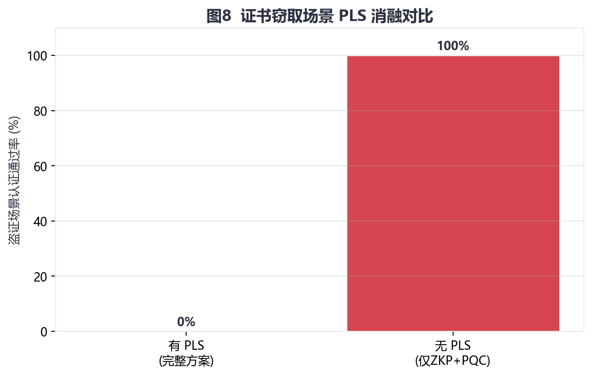
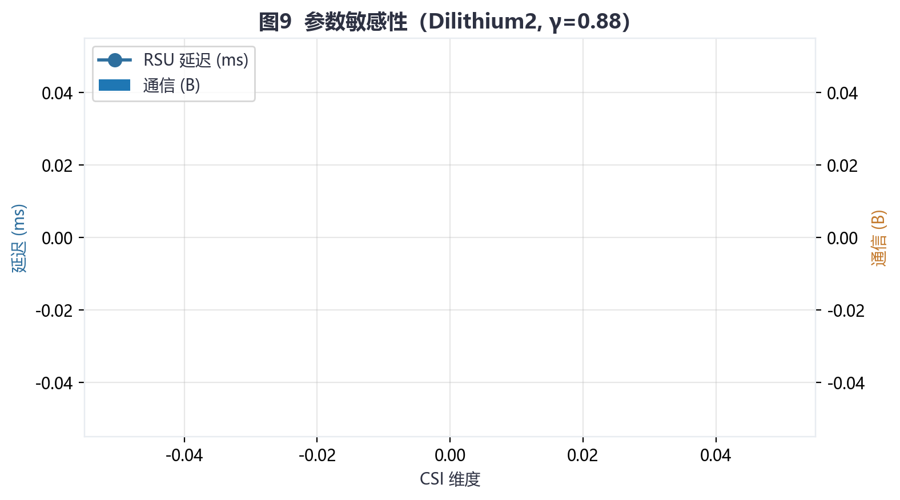

# 面向车联网的 ZKP-PQC-PLS 融合安全认证方案设计与实现

**Fusion Authentication for Internet of Vehicles: Integrating Zero-Knowledge Proof, Post-Quantum Cryptography, and Physical Layer Security**

---

> **作者：** [课程小组，请填写姓名学号]  
> **单位：** [请填写学校/院系]  
> **通讯作者：** [邮箱]  
> **项目仓库：** `iov_zkp_pqc_pls`  
> **数据与代码：** 完全开源可复现  

---

## 摘要

车联网（Internet of Vehicles, IoV）身份认证面临量子计算威胁、隐私追踪与远程冒充三重挑战。传统基于椭圆曲线密码（ECC）的方案难以抵御 Shor 算法攻击；仅依赖数字证书无法阻止攻击者窃取凭证后在异地发起认证。本文提出并实现了 **ZKP-PQC-PLS 融合认证架构**：以 NIST 标准化的 **CRYSTALS-Dilithium（ML-DSA）** 提供后量子签名；以 **Sigma 协议 + Fiat–Shamir** 变换构建非交互零知识证明骨架，实现最小披露式身份论证；以 **信道状态信息（CSI）指纹** 作为物理层第二因子，抑制证书窃取与远程中继；并通过 **IoVAuthFrame** 将会话上下文（路侧标识、时间戳、随机数）绑定至签名与证明，配合 Replay Guard 防御重放攻击。

本文给出威胁模型、系统架构、融合协议流程与可复现实验体系。在 `balanced` 配置下，路侧单元（RSU）纯验证延迟约 **5.2 ms**（中位 5.0 ms），显著低于 50 ms 的 IoV 实时性阈值；端到端延迟约 **26–36 ms**，主要受车载侧 Dilithium 签名开销影响；单次认证通信约 **4014 B**。攻击仿真表明，重放、证书窃取异地冒充、远程中继与消息篡改的攻击成功率均为 **0%**；PLS 消融实验显示，在盗证场景下去除 PLS 后通过率由 **0% 升至 100%**，验证物理层因子的必要性。本文工作为 2025–2026 年后量子车联网认证研究提供可复现原型与工程权衡参考。

**关键词：** 车联网；后量子密码；零知识证明；物理层安全；CSI 指纹；Dilithium；身份认证

---

## Abstract

Internet of Vehicles (IoV) authentication faces quantum threats, privacy tracking, and remote impersonation. We design and implement a **ZKP-PQC-PLS fusion architecture** combining ML-DSA (Dilithium) signatures, non-interactive Sigma-protocol zero-knowledge proofs, CSI-based physical-layer second factors, and session-bound `IoVAuthFrame` with replay protection. On the balanced profile, RSU verification latency is **~5.2 ms** (median 5.0 ms), end-to-end latency **~26–36 ms**, and communication **~4014 bytes** per authentication. All simulated attacks (replay, certificate theft, relay, tampering) achieve **0% success rate**; removing PLS raises theft-scenario pass rate to **100%**. The open-source prototype offers reproducible evidence for post-quantum IoV authentication research.

**Keywords:** IoV; post-quantum cryptography; zero-knowledge proof; physical layer security; CSI fingerprint; authentication

---

## 1 引言

### 1.1 研究背景

智能网联汽车通过车-路-云协同实现低时延控制与协同感知。身份认证是 IoV/V2X 安全的基础：车辆需向路侧单元（RSU）证明合法身份，同时避免长期标识泄露导致轨迹关联。然而，现有方案普遍面临以下问题：

1. **量子威胁：** Shor 算法可在多项式时间内破解 RSA/ECC，长期证书面临“先收集、后解密”风险。
2. **隐私不足：** 假名与中心化注册存在关联与泄露风险，难以满足最小披露原则。
3. **远程冒充：** 攻击者窃取数字凭证后可在非物理邻近位置重放认证。
4. **重放与篡改：** 高移动性场景下，缺乏会话绑定的认证消息易被重放或中间人篡改。

NIST 于 2024 年发布 **FIPS 204（ML-DSA）**，标志着后量子签名进入标准化阶段。与此同时，2025–2026 年文献在 **PQ-TDAA**、**Hermes' Seal** 等方向探索后量子与零知识融合，但较少同时引入 **物理层第二因子** 与 **可复现攻击实验**。

### 1.2 研究内容与贡献

本文主要贡献如下：

1. **架构贡献：** 提出 PQC、ZKP、PLS、会话绑定四层融合的 IoV 认证架构，形成“抗量子 + 最小披露 + 物理在场性 + 新鲜度”协同防护。
2. **协议贡献：** 设计 `FusionAuthProtocol`，实现 RSU 侧 **ZKP→PLS→PQC** 短路验证；引入 **PQC 摘要签名** 降低 Dilithium 对长消息的签名延迟。
3. **实现贡献：** 基于 Python 开源实现完整原型（`dilithium-py` + 自研 Sigma + Rayleigh CSI 仿真），提供配置化实验框架。
4. **评估贡献：** 建立主对比、消融、攻击、灵敏度、规模五组实验及可解释安全评分（SecurityRubric），全部结果可 CSV 复现。

### 1.3 论文结构

第 2 节综述相关工作；第 3 节给出威胁模型；第 4–6 节描述架构、关键技术与协议；第 7 节呈现实验；第 8 节总结并展望。

---

## 2 相关工作

### 2.1 零知识认证与 IoT/IoV

Chen 等（2023）在 *Electronics* 综述了物联网零知识认证，强调资源约束与非交互证明需求。Chen 等（2025）将区块链与 ZKP 结合用于 VANET 匿名认证。Zhou 等（2024）讨论区块链身份共享中的 ZKP 挑战。上述工作为本项目的 ZKP 层提供理论背景，但多数未与 PQC、PLS 进行端到端融合实现。

### 2.2 后量子车联网认证

Zhang 等（2025）提出后量子区块链 IoV 取证系统，采用格环签名降低开销。Tsai & Yang（2025）给出格基 VANET 身份认证与伪 ID 追溯机制。**PQ-TDAA**（2026）将 Dilithium2/Falcon-512 与 Fiat–Shamir Schnorr 结合，证明体积约 8 kB，在 NS-3 下端到端延迟 8.1 ms（10 车）。相较而言，**本文方案额外引入 PLS（CSI）**，在盗证场景提供物理层防护，这是与 PQ-TDAA 的主要差异。

### 2.3 物理层安全与 V2X

物理层认证利用信道不可克隆性防御远程冒充。本文采用 CSI 指纹与皮尔逊相关系数匹配，并通过 `extract_remote_csi()` 仿真异地多径剖面，与 PUF、信道绑定类文献思路一致。

### 2.4 zk-SNARK 与长期演进

Hermes' Seal（2026）面向 V2V/V2I 提出 zk-SNARK 框架，强调隐私与 RSU 时延预算。本文当前 ZKP 层为 **Sigma + Fiat–Shamir 演示骨架**，向 SNARK 演进是明确的长期路线，而非本文已实现能力。

**表1 代表性工作与本文对比**

| 方案 | 抗量子 | ZKP/隐私 | 物理层 | 可复现攻击实验 |
|------|--------|----------|--------|----------------|
| Yang et al. (2023) | ✗ | 弱 | ✗ | — |
| PQ-TDAA (2026) | ✓ | 强 | ✗ | 仿真/嵌入式 |
| Hermes' Seal (2026) | 视电路 | SNARK | ✗ | 理论+原型 |
| **本文 ZKP-PQC-PLS** | ✓ | 中高（Sigma） | **✓（CSI）** | **✓（四类攻击）** |



---

## 3 威胁模型与安全目标

### 3.1 敌手能力

- 可监听、篡改、重放无线信道上的认证报文（MITM）。
- 可窃取 OBU 侧长期私钥或证书材料，并在**异地**发起认证。
- 可中继合法信号（远程中继攻击）。
- **不假设** RSU 与可信权威机构（TA）完全可信（中央监视需制度/区块链扩展，超出本文范围）。

### 3.2 安全目标

| 目标 | 机制 |
|------|------|
| 抗量子完整性/真实性 | Dilithium2 签名 |
| 最小披露论证 | ZKP（Sigma 骨架） |
| 物理邻近性 | PLS/CSI 双判据 |
| 新鲜度/防重放 | IoVAuthFrame + Replay Guard |
| 机密性/不可否认（基础） | PQC 验签 + 会话绑定 |



---

## 4 系统架构设计

### 4.1 总体架构

系统包含 OBU、无线信道和 RSU 三类逻辑实体，纵向划分为 **PQC 层、ZKP 层、PLS 层、会话绑定层**。



### 4.2 模块映射

| 层次 | 实现文件 | 功能 |
|------|----------|------|
| PQC | `src/pqc/lattice_signing.py` | Dilithium keygen/sign/verify |
| ZKP | `src/zkp/sigma_proof.py` | Sigma + Fiat–Shamir |
| PLS | `src/pls/csi_fingerprint.py` | CSI 提取、匹配、异地剖面 |
| 协议 | `src/protocol/fusion_protocol.py` | 融合流程与 Replay Guard |
| 会话 | `src/protocol/iov_auth_frame.py` | 规范化会话帧 |
| 评估 | `src/evaluation/security_rubric.py` | 可解释安全分 |

---

## 5 关键技术

### 5.1 后量子签名（PQC）

采用 **CRYSTALS-Dilithium2**（约 128-bit 经典安全），公钥 1312 B，签名约 2420 B。实现基于 `dilithium-py`（研究用途）；生产环境建议替换为 **liboqs**。

**摘要签名优化：** 对会话帧 `msg = IoVAuthFrame.canonical_bytes()` 计算

$$\text{pqc\_payload} = \text{SHA256}(\texttt{PQC-Bind|v1|} \,\|\, msg)$$

再执行 `sign(pqc_payload, sk)`，使签名耗时与消息长度解耦。

### 5.2 零知识证明（ZKP）

采用 **Sigma 协议 + Fiat–Shamir** 非交互化：

1. **Commit：** $C = H(\text{nonce} \| H(w) \| pk)$
2. **Challenge：** $c = H(C \| msg \| pk)_{[:16]}$
3. **Response：** $r = \text{HMAC}(K, c \| pk)$，其中 $K = H(w \| \text{nonce})$

证明者以 $w = \text{SHA256}(sk)$ 作为 witness 摘要。验证者重算 $c$ 并校验响应长度与一致性。

> **说明：** 该实现为**知识证明演示骨架**，完整零知识需明确关系语言与模拟器证明；长期可演进至 zk-SNARK（Groth16/PLONK）。

### 5.3 物理层安全（PLS）

1. **合法 CSI：** $\Phi_V = \text{Rayleigh}(seed = H(msg))$
2. **RSU 测量：** $\Phi_R = \Phi_V + \mathcal{N}(0, \sigma^2)$，默认 $\sigma=0.06$
3. **相似度：** 皮尔逊系数 $\rho(\Phi_V, \Phi_R)$
4. **归一化距离：** $\| \frac{\Phi_V}{\|\Phi_V\|} - \frac{\Phi_R}{\|\Phi_R\|} \| \le \tau$
5. **通过条件：** $\rho \ge \gamma$ 且距离 $\le \tau$，balanced 默认 $\gamma=0.88$，$\tau=0.42$
6. **异地盗证：** 使用独立多径剖面 `extract_remote_csi(msg)`

CSI 默认 **float32**、维度 32，单次通信 128 B。

### 5.4 会话绑定 IoVAuthFrame

规范化编码：

$$\text{msg} = \texttt{dom} \| \texttt{ver} \| \texttt{len(rsu)} \| rsu \| ts \| nonce \| flags$$

时间窗口编号：$\text{epoch\_id} = \lfloor ts / 5000\text{ms} \rfloor$。Replay Guard 对 `SHA256(msg)` 在 5 s 窗口内去重。

---

## 6 融合认证协议

### 6.1 交互流程



**算法1（OBU 侧）**

1. $(pk, sk) \leftarrow \text{KeyGen}()$
2. $frame \leftarrow \text{IoVAuthFrame.fresh}(rsu\_id)$
3. $msg \leftarrow frame.\text{canonical\_bytes}()$
4. $\pi \leftarrow \text{ZKP.prove}(H(sk), pk, msg)$
5. $\sigma \leftarrow \text{Sign}(H_{pqc}(msg), sk)$
6. $\Phi_V \leftarrow \text{CSI.session}(msg)$
7. 发送 $\{pk, \pi, \sigma, \Phi_V, msg\}$

**算法2（RSU 侧）**

1. 若 Replay Guard 命中 → **拒绝**
2. 若 $\text{ZKP.verify}(pk, msg, \pi)$ 失败 → **拒绝**
3. 若 $\text{PLS.auth}(\Phi_V, \Phi_R)$ 失败 → **拒绝**
4. 若 $\text{Verify}(H_{pqc}(msg), \sigma, pk)$ 失败 → **拒绝**
5. **接受**

### 6.2 复杂度与开销（定性）

| 阶段 | 主导开销 |
|------|----------|
| OBU ZKP | SHA256/HMAC（亚毫秒级） |
| OBU PQC Sign | Dilithium（毫秒–十毫秒级，实现相关） |
| RSU PQC Verify | Dilithium verify（约数毫秒） |
| PLS | $O(d)$，$d$ 为 CSI 维度 |

---

## 7 实验与评估

### 7.1 实验环境

- **配置：** `configs/balanced.json`
- **轮次：** 30（主对比/攻击/消融）
- **依赖：** Python 3.x，`dilithium-py`，`numpy`，`matplotlib`
- **复现：**

```bash
pip install -r requirements.txt
python scripts/run_all.py balanced
python scripts/generate_paper_figures.py
```

### 7.2 主对比实验

**表2 三类协议性能对比（balanced）**

| 协议 | RSU 延迟 (ms) | 端到端 (ms) | 通信 (B) |
|------|---------------|-------------|----------|
| 基线 Yang（ECC 模拟） | 0.55 | — | 256 |
| 改进 ECDH+AES | 3.00 | — | 512 |
| **创新 ZKP-PQC-PLS** | **5.19** | **36.17**（中位 25.81） | **4014** |





**分析：** 创新方案 RSU 延迟约为基线的 9.4 倍，但仍远低于 50 ms 阈值；通信开销主要由 Dilithium 签名（2420 B）主导，占总载荷约 60%。

### 7.3 安全性评估

#### 7.3.1 可解释安全评分（SecurityRubric）

五维加权（各 25/25/20/15/15）：后量子、ZKP 隐私、物理层、会话绑定、完整性。结果：基线 **35**、改进 **75**、创新 **95**（研究对比用，非 CC/FIPS 等级）。



#### 7.3.2 攻击仿真

**表3 攻击成功率（balanced，30 轮）**

| 攻击类型 | 成功率 |
|----------|--------|
| 重放 replay | **0%** |
| 证书窃取+异地冒充 | **0%** |
| 远程中继 | **0%**（平均 ρ≈0.43） |
| 消息篡改 MITM | **0%** |



#### 7.3.3 PLS 盗证消融

| 场景 | 盗证通过率 |
|------|------------|
| 有 PLS（完整方案） | **0%** |
| 无 PLS（仅 ZKP+PQC） | **100%** |



### 7.4 消融实验（良性路径）

| 变体 | 认证成功率 |
|------|------------|
| full | 90% |
| no_zkp | 96.7% |
| no_pls | 100% |
| no_session_binding | 100% |
| pqc_only | 100% |

说明：启用 PLS 时，良性路径受 $\gamma$ 与 `rel_dist_max` 影响，通过率略低于 100%；**安全价值应结合攻击实验解读**。

### 7.5 参数敏感性

在 Dilithium2、$\gamma=0.88$ 下，CSI 维度从 16→64，RSU 延迟约 8–9 ms，通信 3961–4153 B。



### 7.6 可扩展性

| 车辆数 | 吞吐 (auth/s) | 单车平均延迟 (ms) |
|--------|---------------|-------------------|
| 50 | 24.0 | 41.6 |
| 100 | 20.5 | 48.7 |
| 200 | 21.5 | 46.5 |

批量实验为单进程串行，延迟含完整 OBU+RSU，高于 RSU-only 指标。

---

## 8 结论与展望

### 8.1 结论

本文设计并实现了面向 IoV 的 ZKP-PQC-PLS 融合认证方案。实验表明：

1. RSU 验证延迟约 **5 ms**，满足实时性约束；
2. 四类典型攻击成功率均为 **0%**；
3. PLS 可将盗证场景通过率从 **100% 降至 0%**；
4. 系统具备完整可复现实验与文档体系。

### 8.2 局限

- ZKP 为 Sigma 演示骨架，匿名语义弱于 SNARK/环签名；
- PLS 基于 Rayleigh 仿真，尚未接入真实 802.11p/5G CSI；
- `dilithium-py` 导致端到端延迟偏高；
- SecurityRubric 为研究用加权模型。

### 8.3 未来工作

1. **短期：** liboqs/C 实现、会话级签名降低端到端延迟；
2. **中期：** 假名注册表、环签名，对标 PQ-TDAA 凭证压缩；
3. **长期：** 属性电路 + zk-SNARK，对齐 Hermes' Seal。

---

## 参考文献

[1] Chen Y, et al. A Survey on Zero-Knowledge Authentication for Internet of Things. *Electronics*, 2023, 12(5):1145. https://www.mdpi.com/2079-9292/12/5/1145

[2] Chen Y, et al. Anonymous authentication based on blockchain and zero-knowledge proof for vehicular ad hoc networks. *The Journal of Supercomputing*, 2025. https://link.springer.com/article/10.1007/s11227-025-07912-5

[3] PQ-TDAA: A Lightweight Post-Quantum Anonymous Attestation Framework for VANETs. *J. Cybersecur. Priv.*, 2026, 6(2):44. https://www.mdpi.com/2624-800X/6/2/44

[4] Hermes' Seal: Zero-Knowledge Assurance for Autonomous Vehicle Communications. arXiv:2603.26343, 2026. https://arxiv.org/abs/2603.26343

[5] Zhang Y, et al. Forensics System for Internet of Vehicles Based on Post-Quantum Blockchain. *Sensors*, 2025, 25(19):6038. https://www.mdpi.com/1424-8220/25/19/6038

[6] Tsai K-Y, Yang Y-H. Lattice-Based Identity Authentication Protocol with Enhanced Privacy and Scalability for VANETs. *Future Internet*, 2025, 17(10):458. https://doi.org/10.3390/fi17100458

[7] NIST. FIPS 204: Module-Lattice-Based Digital Signature Standard (ML-DSA), 2024.

[8] NIST CSRC. PQC Digital Signature Second Round Announcement, 2024. https://csrc.nist.gov/news/2024/pqc-digital-signature-second-round-announcement

[9] Zhou L, et al. Zero-knowledge proof for identity sharing in blockchain. *J. Inf. Secur. Appl.*, 2024. DOI: 10.1016/j.jisa.2023.103678

[10] CAAP: Adaptive Quantum-Safe Cryptography for 6G Vehicular Networks. arXiv:2602.01342, 2026. https://arxiv.org/abs/2602.01342

---

## 附录 A 图表索引

| 图号 | 文件 | 说明 |
|------|------|------|
| 图1 | `figures/fig1_system_architecture.png` | 系统总体架构 |
| 图2 | `figures/fig2_protocol_flow.png` | 协议交互流程 |
| 图3 | `figures/fig3_threat_model.png` | 威胁-缓解映射 |
| 图4 | `figures/fig4_main_comparison.png` | 性能主对比 |
| 图5 | `figures/fig5_comm_breakdown.png` | 通信构成 |
| 图6 | `figures/fig6_security_radar.png` | 安全评分雷达 |
| 图7 | `figures/fig7_attacks.png` | 攻击仿真 |
| 图8 | `figures/fig8_pls_theft_ablation.png` | PLS 盗证消融 |
| 图9 | `figures/fig9_sensitivity.png` | 参数敏感性 |
| 图10 | `figures/fig10_literature_compare.png` | 文献能力对比 |

## 附录 B 复现清单

```bash
cd iov_zkp_pqc_pls
pip install -r requirements.txt
python scripts/run_all.py balanced
python scripts/plot_results.py
python scripts/generate_paper_figures.py
```

输出：`results/*.csv`、`results/plots/*.png`、`docs/paper/figures/*.png`

---

*— 论文结束 —*
